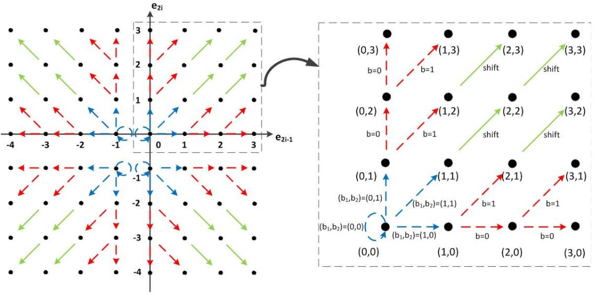
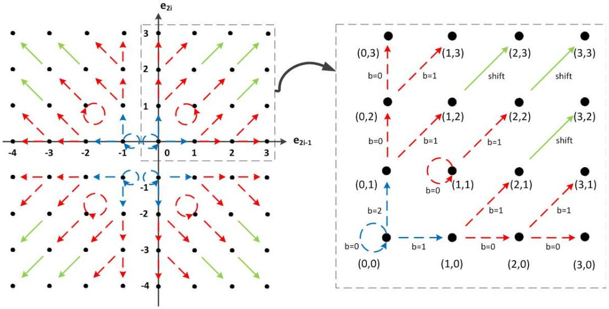
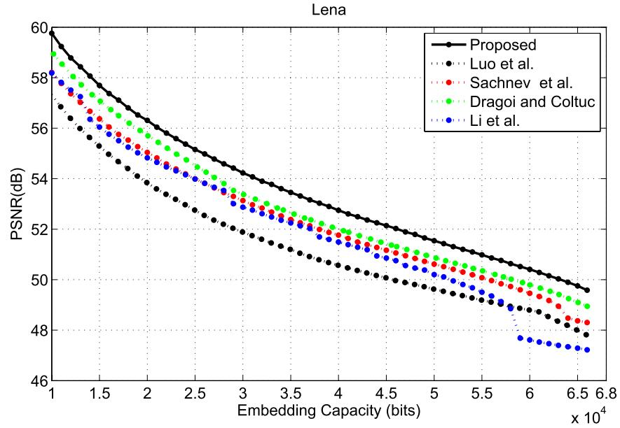
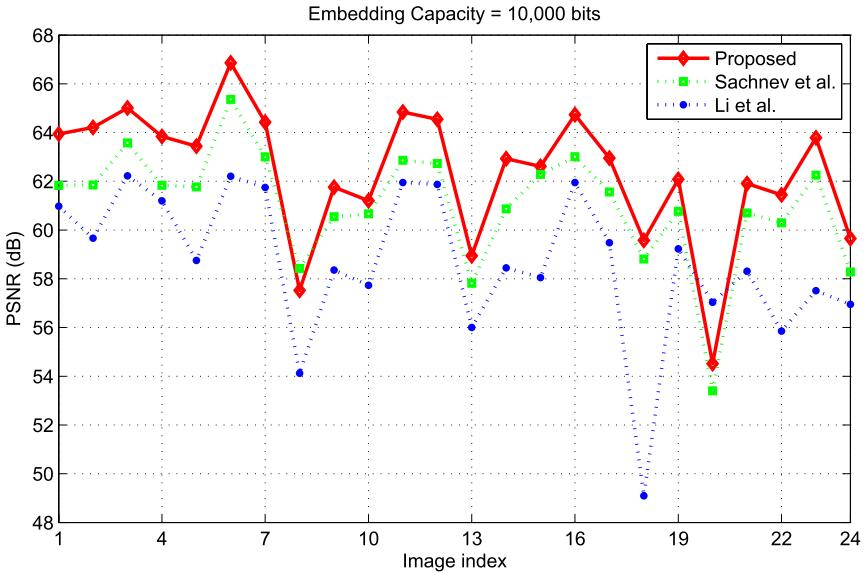
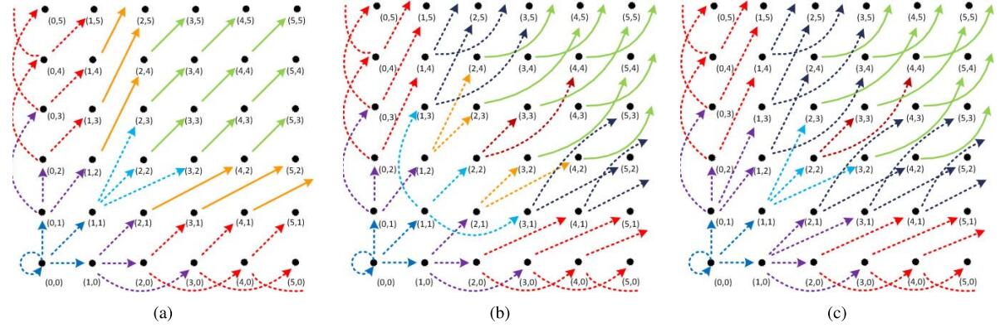

Pairwise PEE
=======


论文题目： "[Pairwise Prediction-Error Expansion for Efficient Reversible Data Hiding](https://ieeexplore.ieee.org/document/6595594)" (TIP 2013).

## 方法简介

经典的双成对预测误差扩展方法，基于2D PEH修改的RDH方法


<p align="center">     </p>
<p align="center"> 图1: 传统方法的2D映射. </p>


<p align="center">     </p>
<p align="center"> 图2: 提出的2D映射. </p>


## 如何运行
本项目主要包含四个文件夹，即```Fig.3 2D-mapping```，```Fig.14 2D-mapping M1```，```Fig.14 2D-mapping M2```和```Fig.14 2D-mapping M3```，它们分别是论文中图3和图14中绘制的不同二维映射的数据嵌入算法。

以及```application Fig.3 2D```和```data extraction Fig.3```：
文件 ```application Fig.3 2D``` 是为应用程序设计的，其中秘密消息由用户输入。在这种情况下，编码器必须知道需要将多少二进制位转换为三进制。
该算法与上述四种算法的不同之处在于，前者增加了从二进制到三进制的数字系统转换，而后者使用伪随机二进制和三进制比特流进行数据嵌入，以消除消息对嵌入性能的影响。因此，前面的四种算法适用于科学目的，可以直接用于性能比较。
```data extraction Fig.3```是```application Fig.3 2D```算法的数据提取和恢复算法。


## Experimental Results

<p align="center">     </p>
<p align="center"> 图3:  对比容量-失真性能. </p>

<p align="center">     </p>
<p align="center"> 图4:  Kodak图像库结果.</p>

<p align="center">     </p>
<p align="center"> 图5: T = 2时的三个扩展2D映射方案. </p>


## 实验环境
Matlab 2016b <br>


## 致谢
这项工作得到了973计划（2011CB302204）的资助，国家杰出青年自然科学基金（61025013）资助，国家国家科学基金（61210006和61272355）资助，PCS（IRT 201206）资助


## 引用格式
如果这项工作对您的研究有帮助, 请按如下格式引用：
```
@ARTICLE{6595594,
  author={Ou, Bo and Li, Xiaolong and Zhao, Yao and Ni, Rongrong and Shi, Yun-Qing},
  journal={IEEE Transactions on Image Processing}, 
  title={Pairwise Prediction-Error Expansion for Efficient Reversible Data Hiding}, 
  year={2013},
  volume={22},
  number={12},
  pages={5010-5021},
  doi={10.1109/TIP.2013.2281422}}
```


## 版权声明
受欧博老师委托，本项目已开源 (详见 ``` MIT LICENSE ``` ).
